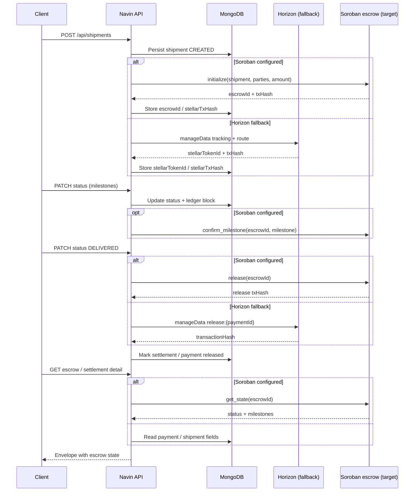

# Blockchain & escrow integration

This document describes how Navin Backend uses Stellar today (Horizon +
`manageData` emulation) and the roadmap to a real **Soroban escrow contract**
expected by the frontend.

Related issues:

- [#360](https://github.com/Navin-xmr/navin-backend/issues/360) — Soroban escrow contract integration
- [#361](https://github.com/Navin-xmr/navin-backend/issues/361) — On-chain event indexer for settlements / milestones
- [#363](https://github.com/Navin-xmr/navin-backend/issues/363) — Dynamic Stellar / explorer URLs

---

## Current state (Horizon-only fallback)

All on-chain writes go through the Stellar **Horizon** HTTP API via
`@stellar/stellar-sdk` in `src/services/stellar.service.ts`. There is **no**
Soroban RPC client and **no** deployed escrow contract ID in the runtime path
today (env placeholders exist; see below).

| Operation | Function | Mechanism | When |
|-----------|----------|-----------|------|
| Tokenize shipment | `tokenizeShipment` | Horizon `Operation.manageData` for `tracking:{shipmentId}` and `route:{shipmentId}` | Shipment create |
| Anchor telemetry | `anchorTelemetryHash` | Horizon `manageData` + `Memo.hash` | Stellar worker after telemetry ingest |
| Release escrow | `releaseEscrow` | Horizon `manageData` `release:{paymentId}` + memo `escrow-release:…` | Shipment reaches `DELIVERED` |

Config / network:

- `STELLAR_SECRET_KEY` — signing key for the backend account
- `STELLAR_NETWORK` — `testnet` | `public` (selects Horizon network passphrase)
- Horizon server is currently hard-coded to `https://horizon-testnet.stellar.org` in code
- Explorer links: `getStellarExplorerUrl(txHash)` → stellar.expert

### Error Handling Note

In `src/services/stellar.service.ts:157–160`, `releaseEscrow` catches any submission or network errors and swallows them, returning `{ success: false }` instead of throwing an `AppError`. Callers handle unfulfilled settlements via payment retry status.

### Event Indexing & Confirmation Tracking

A background BullMQ worker (`src/workers/stellar-indexer.worker.ts:112–132`) runs on a 30-second interval (`STELLAR_INDEXER_JOB`). It calls `indexStellarTransactions`, polling Horizon account operations to verify on-chain confirmations and update settlement records in MongoDB.

### Why this is a fallback

`manageData` entries prove that the backend account recorded an event; they do
**not**:

- Hold or transfer payment value in escrow
- Enforce multi-party confirmations on milestones
- Expose a queryable on-contract state machine the frontend can poll

Escrow “release” today is an audit write, not a fund disbursement.

---

## Gap to Soroban

| Capability | Horizon fallback | Soroban target |
|------------|------------------|----------------|
| Escrow funding / hold | None | Contract holds / tracks escrowed amount |
| Milestone confirmation | Off-chain status + optional ledger block | `confirm_milestone` on-contract |
| Release on delivery | `manageData` release marker | `release` moves funds / finalizes state |
| Read escrow state | DB + payment documents | `get_state` via Soroban RPC |
| Event indexing | Polling indexer (`stellar-indexer.worker.ts`) | On-chain event indexer ([#361](https://github.com/Navin-xmr/navin-backend/issues/361)) |
| Network / explorer URLs | Partially hard-coded | Dynamic URLs ([#363](https://github.com/Navin-xmr/navin-backend/issues/363)) |

Until Soroban lands, keep Horizon paths as the **default fallback** so create /
delivery flows continue to work without `SOROBAN_RPC_URL` or `ESCROW_CONTRACT_ID`.

---

## Target Interface & Migration Plan

The target Soroban escrow contract method definitions and TypeScript interfaces are specified in [docs/chain-interface.md](file:///home/izk/Documents/DRIPS/navin-backend/docs/chain-interface.md) (marked **DRAFT v0**).

### Migration Plan (ChainAdapter Port Architecture)

Instead of temporary config-presence flags spread across services, the integration moves behind a unified `ChainAdapter` port:

1. **Interface Freeze**: Formalize `ChainAdapter` port interface in `docs/chain-interface.md`.
2. **Implement `SimulatedAdapter`**: Package existing Horizon `manageData` logic into `SimulatedAdapter` implementing `ChainAdapter`.
3. **Implement `SorobanAdapter`**: Build `SorobanAdapter` using Soroban RPC client (`SOROBAN_RPC_URL`) and smart contract (`ESCROW_CONTRACT_ID`).
4. **Adapter Factory**: Instantiate the appropriate `ChainAdapter` dynamically via factory configuration.
5. **Persist Contract Identifiers**: Persist `escrowId` / transaction hashes on payment and shipment documents.
6. **Indexer Integration**: Extend `stellar-indexer.worker.ts` to index Soroban contract events into settlements and ledger modules.

---

## Environment variables

| Variable | Required for | Description |
|----------|--------------|-------------|
| `STELLAR_SECRET_KEY` | Horizon + Soroban signing | Backend account secret |
| `STELLAR_NETWORK` | Both | `testnet` or `public` |
| `SOROBAN_RPC_URL` | Soroban only | Soroban JSON-RPC endpoint |
| `ESCROW_CONTRACT_ID` | Soroban only | Deployed escrow contract ID (`C…`) |
| `STELLAR_WEBHOOK_SECRET` | Webhooks | HMAC for `POST /api/webhooks/stellar` |

Placeholders already appear in `.env.example` and are mapped in `src/config/index.ts`
as `config.sorobanRpcUrl` / `config.escrowContractId`. They are unused by the
Horizon fallback path today.

---

## Escrow lifecycle (sequence)



ASCII equivalent:

```
Shipment created
    │
    ├─[Soroban]─► initialize ──► store escrowId
    └─[Horizon]─► manageData tokenize ──► store stellarTokenId/txHash
    │
Milestone updates
    │
    ├─[Soroban]─► confirm_milestone (optional per status)
    └─[Both]────► DB status + ledger block
    │
Delivered
    │
    ├─[Soroban]─► release
    └─[Horizon]─► manageData release marker
    │
UI / detail
    │
    ├─[Soroban]─► get_state
    └─[Fallback]► payment/shipment documents
```

---

## Operational notes

- Use the `ChainAdapter` factory (`SimulatedAdapter` vs `SorobanAdapter`) to select runtime provider cleanly.
- Never log `STELLAR_SECRET_KEY` or raw contract signing payloads.
- Keep response envelopes unchanged; expose new on-chain fields only under
  documented shipment / payment / settlement schemas in `docs/swagger.yaml`.

