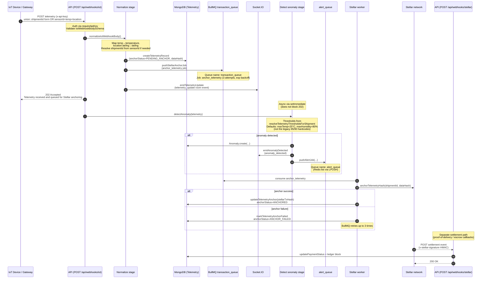

# Telemetry Ingestion Pipeline

End-to-end flow from IoT webhook intake through BullMQ anchoring, Socket.IO fan-out, and anomaly detection.

Related real-time event payloads are documented in [websockets.md](./websockets.md).
OpenAPI request/response schemas live in [swagger.yaml](./swagger.yaml) under `POST /api/webhooks/iot` and `POST /api/webhooks/stellar`.

## Sequence diagram



## Stage annotations

| Stage | Trigger | Implementation | Notes |
|-------|---------|----------------|-------|
| **1. Ingest** | `POST /api/webhooks/iot` with `x-api-key` | `iot.controller.ts` / `iot.routes.ts` | Returns **202** immediately after persist + queue enqueue. |
| **2. Normalize** | Validated webhook body | `normalizeIotWebhookBody` in `iot.service.ts` | Accepts a **union** of shipment-centric and sensor-centric payloads (see Swagger). |
| **3. Persist** | Normalized body | `telemetryService.createTelemetryRecord` | Stores `dataHash`, `rawPayload`, `anchorStatus=PENDING_ANCHOR`. |
| **4. Queue (anchor)** | After persist | `pushStellarAnchorJob` → BullMQ **`transaction_queue`** | Job name `anchor_telemetry`; 3 attempts with exponential backoff. |
| **5. Emit socket** | After queue | `emitTelemetryUpdate` | Event: `telemetry_update` (see websockets.md). |
| **6. Detect anomaly** | `setImmediate` after 202 | `detectAnomaly` → `evaluateTelemetry` | Uses org/shipment thresholds; defaults **25°C / 80% RH / 20% battery**. |
| **7. Emit + alert** | When `result.detected` | `emitAnomalyDetected` + `pushAlertJob` | Alert path uses Redis list **`alert_queue`**. |
| **8. Anchor** | BullMQ worker | `stellar.worker.ts` on `transaction_queue` | Writes `stellarTxHash` or marks `ANCHOR_FAILED`. |
| **9. Settlement webhook** | Stellar callbacks | `POST /api/webhooks/stellar` | HMAC-verified payment status updates (`release` / `escrow` / `failed`). |

## BullMQ / Redis queues

| Queue name | Mechanism | Producer | Consumer | Purpose |
|------------|-----------|----------|----------|---------|
| `transaction_queue` | BullMQ `Queue` / `Worker` | `pushStellarAnchorJob` (`src/infra/redis/queue.ts`) | `src/workers/stellar.worker.ts` | Anchor telemetry data hashes on Stellar. |
| `alert_queue` | Redis list (`LPUSH`) + BullMQ worker variant | `pushAlertJob` (`src/infra/redis/queue.ts`) | Alert workers (`src/workers/alert.worker.ts`, `src/services/queue.service.ts`) | Fan out anomaly / status alerts. |

Both names are stable contract identifiers — do not rename without a coordinated worker deploy.

## Anomaly detection thresholds (25/80 vs legacy 85/90)

Pipeline anomaly detection resolves thresholds via `resolveTelemetryThresholdsForShipment` (`telemetryThreshold.service.ts`), which merges org/shipment-type overrides with:

```ts
// src/modules/telemetry/telemetryThreshold.constants.ts
DEFAULT_TELEMETRY_THRESHOLDS = {
  maxTemp: 25,        // °C — cold-chain friendly default
  maxHumidity: 80,    // %
  minBatteryLevel: 20 // %
}
```

**Historical note:** `getTelemetryThresholds()` in `telemetry.service.ts` still exposes the older hardcodes `{ maxTemp: 85, maxHumidity: 90, minBatteryLevel: 20 }` for the `GET /api/telemetry/thresholds` compatibility path. Live IoT webhook / bulk ingest anomaly evaluation uses the **25 / 80** defaults (and any org overrides), not 85 / 90. Treating 85/90 as the operational alert ceiling under-detects cold-chain violations.

Severity and type evaluation is implemented in `src/services/anomaly.service.ts` (`evaluateTelemetry`).

## Payload shapes (summary)

### `POST /api/webhooks/iot` (union)

**Normalized (shipment-centric):**

```json
{
  "shipmentId": "507f1f77bcf86cd799439011",
  "temperature": 22.5,
  "humidity": 55,
  "latitude": 12.34,
  "longitude": 56.78,
  "batteryLevel": 88,
  "timestamp": "2026-01-15T12:30:00.000Z"
}
```

**Sensor-centric:**

```json
{
  "sensorId": "SENSOR-42",
  "temp": 22.5,
  "humidity": 55,
  "location": { "lat": 12.34, "lng": 56.78 },
  "batteryLevel": 88,
  "timestamp": "2026-01-15T12:30:00.000Z"
}
```

Response: **202** with the standard `{ success, message, data }` envelope; `data.anchorStatus` starts as `PENDING_ANCHOR`.

### `POST /api/webhooks/stellar`

HMAC header `x-stellar-signature` required. Body: `{ id, type, paymentId, transactionHash, amount, timestamp, signature? }` where `type` ∈ `release | escrow | failed`. Response: **200**.

## Key source files

| Concern | Path |
|---------|------|
| IoT route / auth | `src/modules/webhooks/iot.routes.ts` |
| Normalize + pipeline orchestration | `src/modules/webhooks/iot.service.ts` |
| Zod union schemas | `src/modules/webhooks/iot.validation.ts` |
| Stellar settlement webhook | `src/modules/webhooks/stellar.webhook.*` |
| Queue helpers | `src/infra/redis/queue.ts`, `src/services/queue.service.ts` |
| Anchor worker | `src/workers/stellar.worker.ts` |
| Anomaly detect | `src/modules/anomaly/anomaly.service.ts` |
| Default thresholds | `src/modules/telemetry/telemetryThreshold.constants.ts` |
